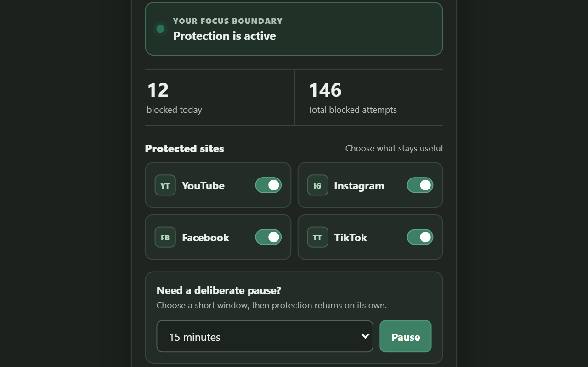
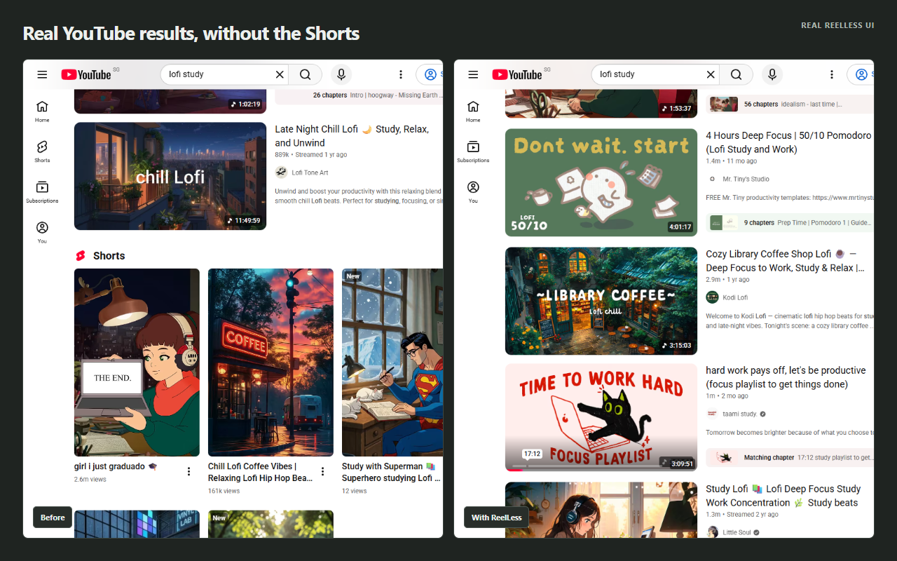
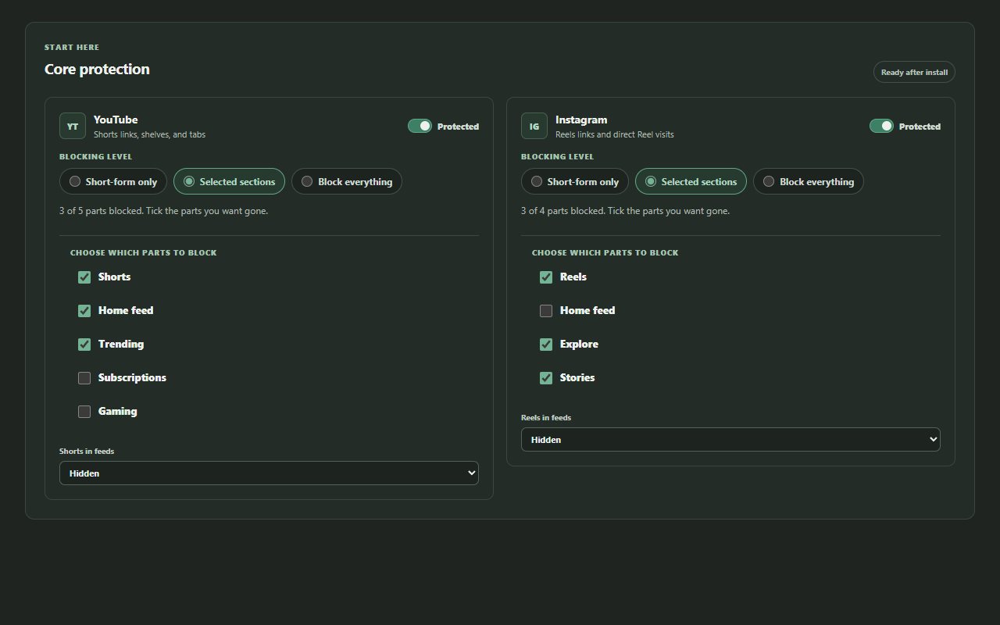
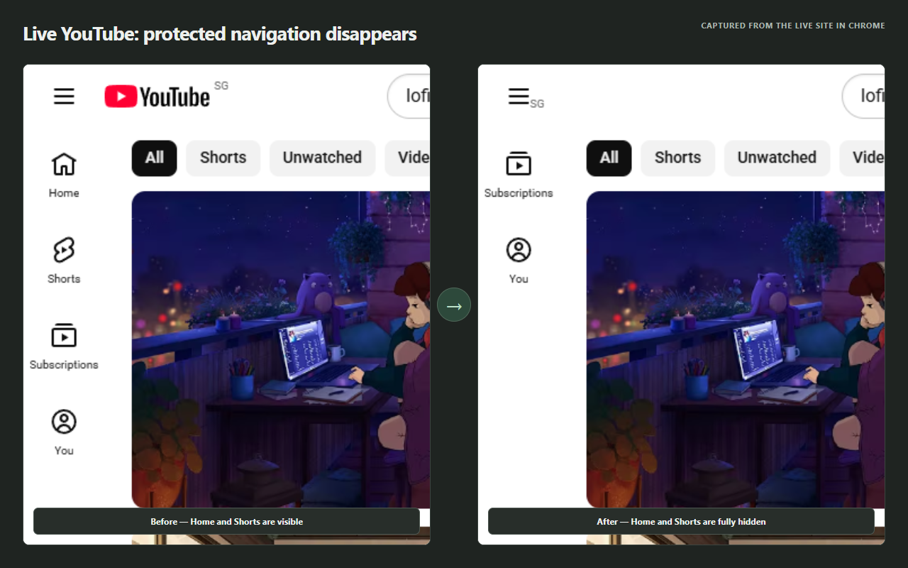
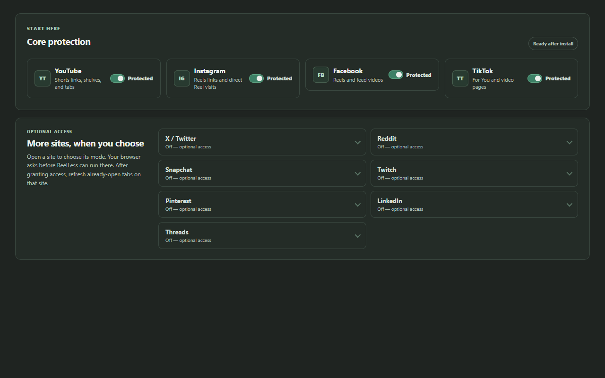
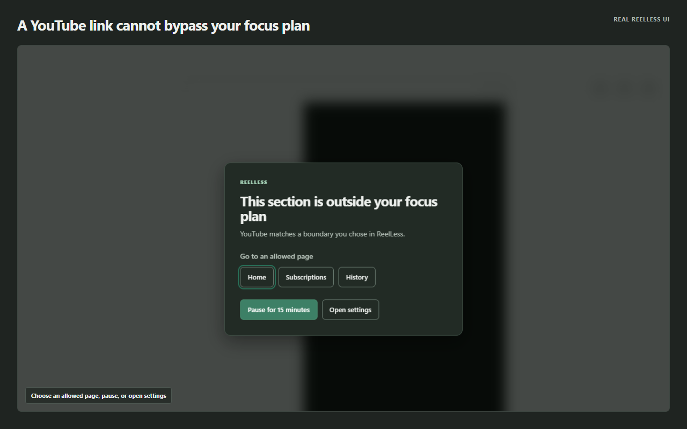
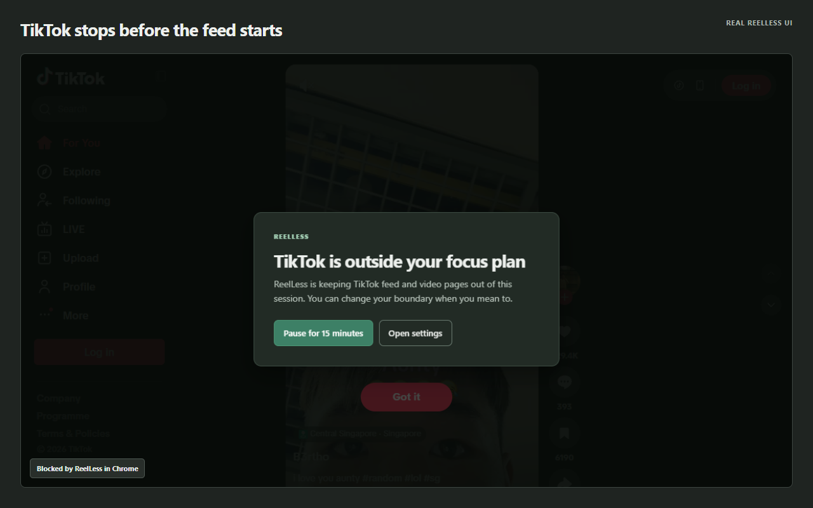

# ReelLess

<p align="center">
  
</p>

<p align="center"><strong>Keep the useful parts. Lose the endless video.</strong></p>

<p align="center">
  A private, open-source focus extension for Chrome, Edge, and Firefox.<br>
  Hide Shorts and Reels, block distracting sections, and keep search, messages, profiles, and the pages you actually came for.
</p>

<p align="center"><strong>No account · No ads · No analytics · No data leaves your browser</strong></p>



## Your feeds, minus the trap

ReelLess removes or disables short-form entry points before they pull you into the next video. Direct visits to protected pages stop on a calm focus screen instead of autoplaying.



The useful parts stay available: ordinary YouTube videos and search, Instagram profiles and Direct, Facebook posts and Messenger, plus the sections you choose to keep on every supported site.

## More control than a simple on/off blocker

Choose **Short-form only**, **Selected sections**, or **Block everything** for each site. In Selected sections mode, every checkbox is independent: block YouTube Home and Trending while keeping Subscriptions, or hide Instagram Reels, Explore, and Stories while leaving the main feed available.



Blocked Shorts and Reels can be completely **Hidden** or left **Visible, but unable to open**. ReelLess can also quiet page furniture such as recommendations, sidebars, comments, and end-screen suggestions without blocking the underlying page.

The change is visible on the live site itself. In this signed-out YouTube test, **Home** and **Shorts** are present before protection. After ReelLess turns on, those protected navigation entries disappear completely while **Subscriptions** remains available.



## Eleven supported sites

Four core sites work immediately after installation. Seven more are opt-in, and the browser asks for access only when you enable one.



| Ready after install | Optional access |
| --- | --- |
| YouTube | X / Twitter |
| Instagram | Reddit |
| Facebook | Snapchat |
| TikTok | Twitch |
|  | Pinterest |
|  | LinkedIn |
|  | Threads |

Across those sites you can target Shorts, Reels, video feeds, Home, Explore, Trending, Stories, LIVE, Groups, Events, Notifications, and many other attention-heavy sections. You can also add an exact custom domain or path when a built-in checklist does not cover it.

## Hidden does not mean bypassable

Removing a tab is only the first layer. If someone pastes its address, follows an external link, uses a bookmark, or otherwise navigates directly to a protected page, ReelLess stops the page and shows **This section is outside your focus plan**.

The window offers links to other pages that are still allowed under the current settings—such as **Home**, **Subscriptions**, or **History**—and never suggests the section that was blocked. The user can also take a deliberate 15-minute pause or open Settings to change the boundary.



Fully protected feeds stop before playback starts. Here the production ReelLess guard is running in Chrome at TikTok's URL and replaces the page with its focus boundary before feed playback.



Protection records the deliberate attempt locally. A short pause turns protection back on automatically when it ends.

Other focus tools include:

- Work, study, evening, sleep, and custom schedules
- Today and all-time blocked-attempt counts stored only in the browser
- Optional **Ultimate Lock**, with a deliberate timed release flow
- Dark, light, and system themes
- Custom page boundaries for sites outside the built-in list

> The README images are generated from a temporary Chrome extension profile. YouTube is captured from the real signed-out site, and TikTok is captured from the real signed-out site when it is reachable. No social account is opened, and the images contain no account names, messages, or personal browsing history.

## Private by design

ReelLess runs locally. It does not send telemetry, create an account, inject remote code, or call an analytics service. Settings and counts stay in browser storage and disappear when the extension or its browser data is removed.

The four core sites are declared at install time. Every optional site and custom page uses browser-managed optional access, requested only when you turn that protection on. See the full [privacy policy](PRIVACY.md) and [security review](SECURITY_REVIEW.md).

## Install it locally

1. Download or clone this repository.
2. Open `chrome://extensions` in Chrome or Edge.
3. Enable **Developer mode**, choose **Load unpacked**, and select this folder.
4. Pin ReelLess and open its Settings page to choose your boundaries.

Firefox users can create the Firefox build with `npm run build:firefox` and load the generated package temporarily from `about:debugging`.

## Tested like a product

The automated suite covers settings migration, URL and section matching, dynamic page changes, feed hiding, focus screens, Direct and Messenger safety, optional permissions, browser packaging, Firefox compatibility, and store-asset dimensions. The browser smoke suite loads the unpacked extension into Chromium and exercises the real popup, Settings page, and guarded sites.

```powershell
npm install
npm test
npm run validate
npm run smoke
npm run build
```

Generate the privacy-safe README and store captures with:

```powershell
$env:REELLESS_HEADLESS = "1"
npm run screenshots
```

Current Chrome and Edge releases and desktop Firefox are supported. The four core sites also work on Firefox for Android; optional-site and custom-page access depends on browser UI that is not currently available there. Platform layouts change frequently, so authenticated and signed-out manual checks are still part of every release.

## Project links

- [Store listing copy](STORE_LISTING.md)
- [Manual testing guide](MANUAL_TESTING.md)
- [Contributing](CONTRIBUTING.md)
- [Security policy](SECURITY.md)
- [Changelog](CHANGELOG.md)
- [License](LICENSE)

ReelLess is independent and is not affiliated with YouTube, Instagram, Facebook, TikTok, or their owners. Platform names and trademarks belong to their respective owners.
