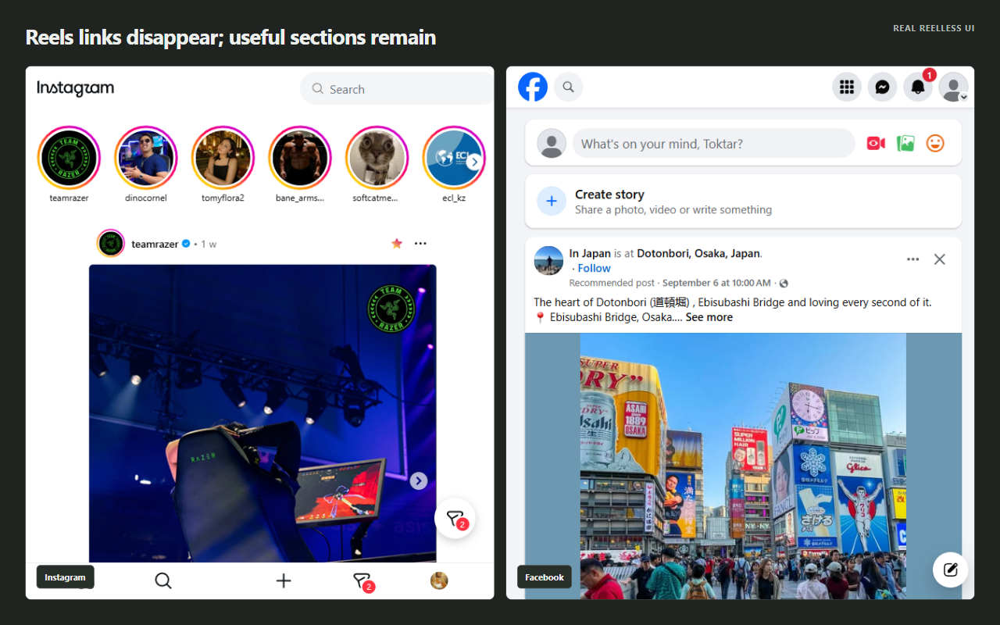
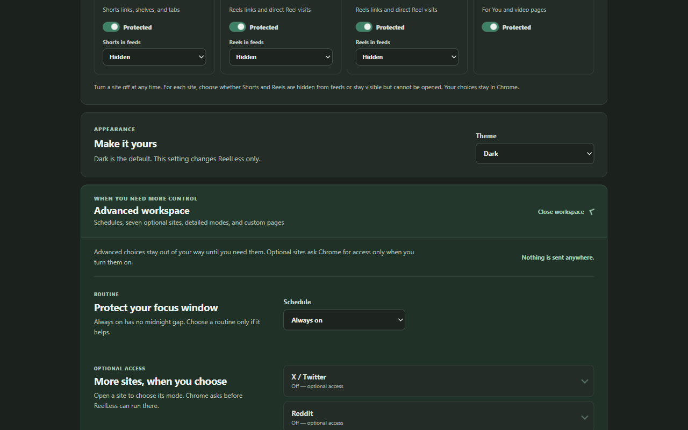

# ReelLess – Stay Focused Online

> **ReelLess – Focus Browser Add-on:** Hides YouTube Shorts, Instagram Reels and TikTok videos, with customizable settings to hide and block specific tabs across 11 sites. 100% offline, private, tested.

Free, open-source add-on for Chrome + Firefox. No accounts, no ads, no tracking.

## Why I built this

Short videos are designed to keep you scrolling. I wanted a tool that removes the distraction but keeps the useful parts — messages, search, profiles, learning videos — so students can focus without quitting social media completely.




## What it does

- **Hides distracting videos in-place:** YouTube Shorts, Instagram / Facebook Reels, TikTok videos disappear from feeds. Pages stay smooth and scrollable — no reloads, no blank gaps, no jumping.
- **Hide and block specific tabs:** e.g. YouTube Home / Trending, Instagram Explore, Facebook Groups, TikTok LIVE, X Explore, Reddit Home, LinkedIn Feed and more. You choose, everything else keeps working.
- **Stays out of your messages:** Instagram Direct and Messenger threads are never touched.
- **Focus helpers:** study / work schedules, short pauses, daily count of avoided distractions, calm focus screen instead of autoplay.
- **Ultimate Lock (optional):** extra self-control mode that locks protection on until you finish a short timed release ritual.
- **Private by design:** everything runs on your device. Nothing is collected or sent anywhere.




## Built like a real product

- Works on 11 sites, 40+ sections, with settings that safely carry over between updates
- Fast and stable on busy feeds (tested scrolling, no flicker)
- Full test suite + security and privacy reviews in this repo
- Store-ready builds for Chrome and Firefox (`npm run build`)

## Try it locally

1. Open `chrome://extensions`.
2. Enable **Developer mode**.
3. Click **Load unpacked** and select this folder.
4. Pin ReelLess, then open YouTube, Instagram, Facebook or TikTok.

<details>
<summary><b>Full feature details (click to expand)</b></summary>

- X / Twitter: Block Home feed, Explore, Notifications, Messages, Communities, Grok, plus hide recommendations and sidebar distractions. Profiles, posts and bookmarks stay available.
- Reddit: Block Home feed, Popular / News / Explore, Chat, Notifications, inbox, plus hide sidebar distractions. Communities, posts, comments and search stay available.
- More sites: Snapchat Spotlight, Twitch Home / Browse / Clips / Videos / Drops, Pinterest Home / Explore / Search, LinkedIn Feed / Videos / Notifications / Messaging / My Network, Threads Home / Activity. Jobs, search, profiles and messages stay available.
- YouTube Shorts, Instagram / Facebook Reels, TikTok videos are hidden in feeds. Opening one shows a calm focus screen instead of playing.
- Choice per site: **Hidden** or **Visible, can't be opened**.
- Instagram Direct and Messenger threads are never modified.
- Only deliberate attempts increase the local today / all-time count.
- Schedules, full-site modes, section controls and custom domains live under Advanced.
- Ultimate Lock (optional): locks protection on. Removal needs a typed phrase, private reflection and timed check-ins. Browser admins can still disable/uninstall the extension.

</details>

## For developers

Install the test dependencies once:

```powershell
npm install
npx playwright-core install chromium
```

Then run:

```powershell
npm test
npm run validate
npm run smoke
npm run build
```

The smoke suite uses a temporary Chrome for Testing profile because current branded Chrome builds ignore command-line unpacked-extension loading. Manual Chrome installation still uses `chrome://extensions` as described above.

The verified Web Store package is created at `dist/reels-blocker.zip`, with `manifest.json` at the ZIP root.

## Release

- Store copy: [STORE_LISTING.md](STORE_LISTING.md)
- Privacy policy: [PRIVACY.md](PRIVACY.md)
- 90-day launch checklist: [LAUNCH_PLAN.md](LAUNCH_PLAN.md)
- Public site: `docs/` (ready for GitHub Pages)

Before public release, complete a trademark check for “ReelLess,” manually test authenticated and logged-out platform layouts, create the Chrome Web Store developer account, and upload the verified ZIP with deferred publishing.

ReelLess is independent and is not affiliated with YouTube, Instagram, Facebook, TikTok, or their owners. Platform names and trademarks belong to their respective owners.
